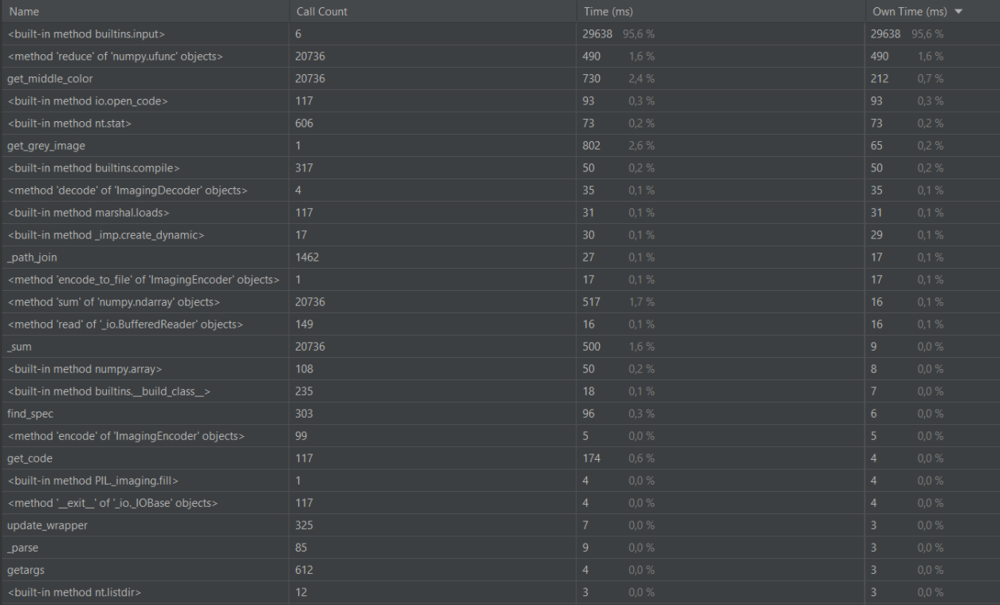
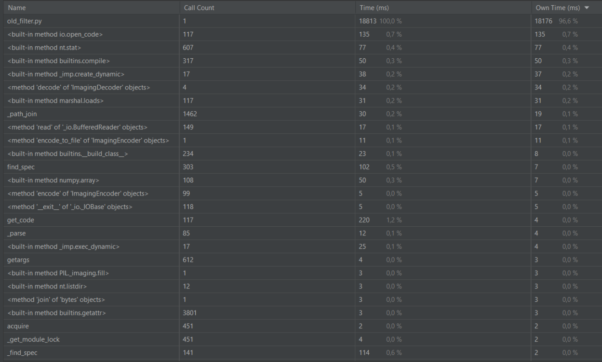
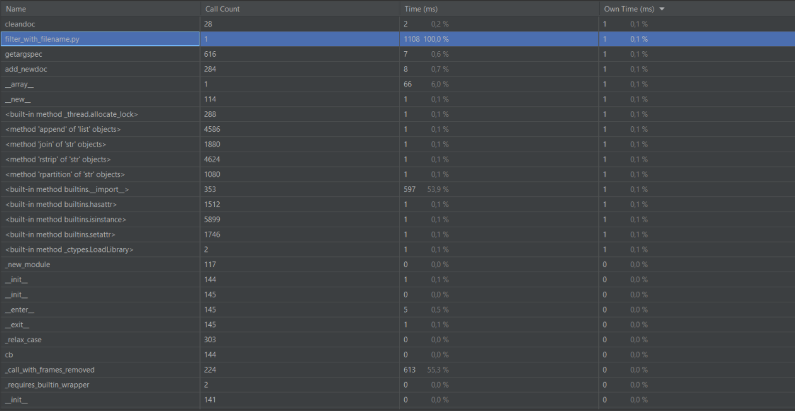
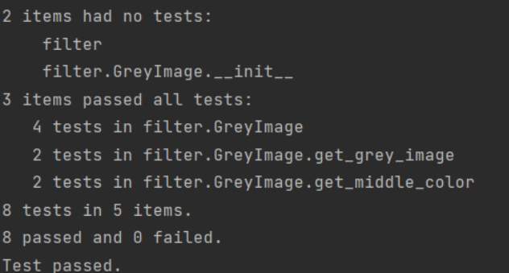
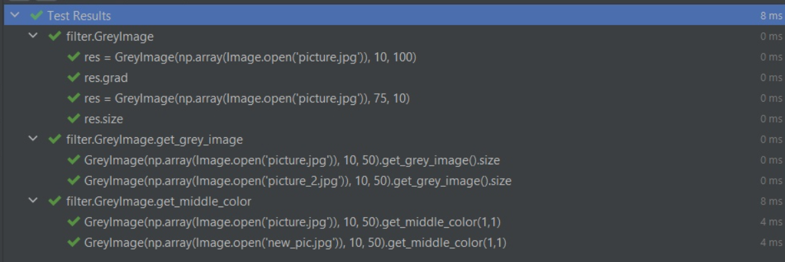
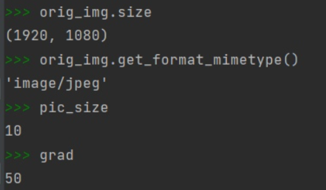

PIXEL ART
===========

С помощью приложения вы накладываете фильтр, получаете черно-белый пиксель-арт, который можно набрать уже мозаикой.

Исходная картинка:
============

Запуск filter.py:
----------

Запуск old_filter.py:
--------------

Запуск filter_with_filename.py:
--------------

Результат:
================

Тестирование и отладчик:
===============

Мы получаем огромную разницу во времени из-за ожидания пользовательского воода в файле filter.py. В файле filter_with_filename.py изначало прописано имя картинки и прочие необходимые нам параметры. За счет этого небольшого изменения время выполнение программы существенно сократилось. Полученное время намного меньше времени выполнения old_filter.py. Из этого можем сделать вывод, что отрефакторенный код намного быстрее первоначального.
