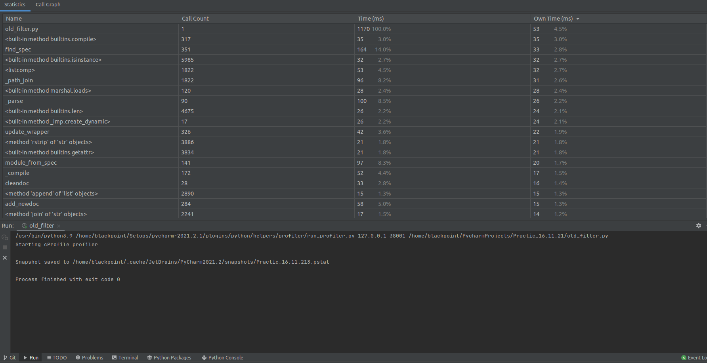

Профилирование  
  
Новый фильтр 
Старый фильтр 
Время выполнения нового фильтра меньше за счёт оптимизаций количества операций  
.........  
Результат профилирования filter_with_filename.py   
.........  
doctest   
.........
 
